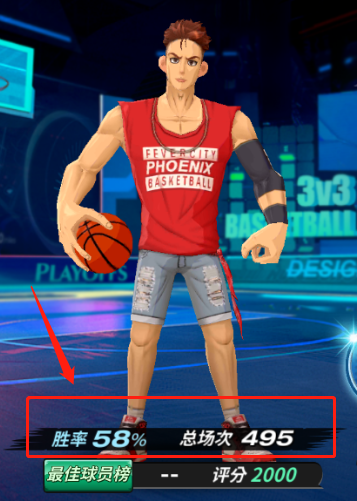
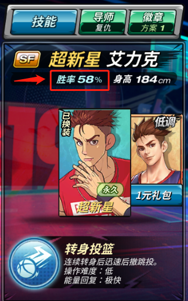
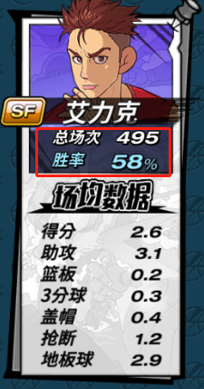
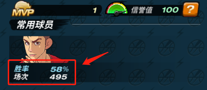

## 1. 游戏中的胜率数据

* “我的球员” 界面

    * 协议：`GetPlayerGameInfo`
    * 数据：`player_battle_detail100114103`

        

* “匹配选人” 界面

    * 协议：`GetPlayerGameInfo`
    * 数据：`player_battle_detail100114103`

        

* “常用球员” 界面

    * 协议：`GetUserAccountInfo`
    * 数据：`user_games_player_used_100114103`

        

* “基本资料” 界面

    * 协议：`GetMajorPlayerBattleDetail`
    * 数据：`player_battle_detail100114103`

        
