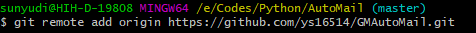

# Git Command

## 1. Git 是什么？

> Git 是用 C 编写的分布式版本控制系统，可以用来管理文件（代码、word等）的多个版本

## 2. Git 和 SVN 有什么区别？
* Git 是分布式的，每一台主机都保存着完整的版本库信息，个人工作的情况下无需联网

    
* SVN 是集中式的，版本库信息只保存在中央服务器中，每一台主机需要联网才能访问版本信息

    

* Git 和 SVN 最大的区别是维护版本信息的位置不同。
    * Git 中，每个主机都有完整的版本信息，如果充当中央服务器的 Git 仓库挂了，那么可以从一个主机中获取完整的版本可信息，重建中央服务器
    
    * SVN 中，只有中央服务器记录了完整的版本信息，每个主机需要在联网的环境下从中央服务器获取，如果中央服务器挂了，主机们将无法工作

* Git 的 `commit id` 是一串十六进制数，SVN 的 `commit id` 是由 1 递增的值

## 3. Git 的使用

* 安装后，需要打开 `Git Bash` 进行使用前的一些设置。因为 Git 是分布式版本控制系统，所以，每个主机都必须设置用户名和邮箱用来标识主机。命令为 `git config --global user.name "xxx"`，`git config --global user.email "yyy"`
    * 其中的 `--global` 表示本机的所有 Git 库都采用同样的用户名和邮箱

        

* 将某个目录设置为一个 repository（本地 Git 仓库）。设置为 repository 意味这该目录下的所有文件的增删改都会被 Git 记录追踪，用于以后的还原。命令为 `git init`
    * 下图将 `E:\Codes\Python\AutoMail` 目录设置为 Git 仓库
    * 设置完成后，`E:\Codes\Python\AutoMail` 目录下会自动生成隐藏的 `.git\` 文件夹，用于管理 repository

        

* 添加文件到 **本地 Git 仓库** 。添加文件分为两个步骤：
    * 将文件从本地工作区添加到本地 Git 缓存区。命令为  `git add "filename"` 或 `git add .`
    * 将文件从 Git 缓存区提交到本地 Git 仓库。命令为  `git commit -m "comment"`，`-m "comment"` 即本次提交的备注，方便后续查阅

        

    * 下图将 `AutoGmMail.py` 添加到了 Git 仓库（`E:\Codes\Python\AutoMail`）

        

* 查看 Git 仓库中的文件改动。
    * 若仓库内的文件在上次 `commit` 后无改动，执行 `git status` 命令查看当前 Git 仓库的状态，显示仓库是 clean 的

        

    * 若仓库内的文件在上次 `commit` 后有了改动，但未添加到本地 Git 缓存区，执行 `git status` 命令后，会提示本次哪些文件有了改动，需要 **先添加再提交**

        
        
    * 若仓库内的文件在上次 `commit` 后有了改动，且已添加到本地 Git 缓存区，但未提交到本地 Git 仓库，执行 `git status` 命令后，会提示本次哪些文件有了改动，且 **已准备好提交**

        

    * 使用 `git diff "filename"` 命令可查看文件较上次 `commit` 后具体的改动
        
        `git diff` 比较的是 工作区 和 缓存区 的差异

        `git diff --cached` 比较的是 缓存区 和 仓库区 的差异

        `git diff HEAD` 比较的是 工作区 和 仓库区 的差异

        （需要注意的是，`commit` 后，缓存区的内容并不是清空，而是和仓库区保持一致，所以未 `add` 时，`git diff` 会给人一种 “比较的是 缓存区 和 仓库区” 的错觉）

        （可以这样理解：`add` 操作是让 **缓存区** 与 **工作区** 一致，`commit` 操作是让 **仓库区** 与 **缓存区** 一致，因此未 `add` 时，缓存区仍是上次 `add` 之后的版本，`git diff` 比较出了 **工作区** 与 **缓存区** 不一致）

        
    
    * `commit` 后再次使用 `git status` 命令查看当前 Git 仓库的状态，显示仓库是 clean 的

        
         
    * Git 管理的是文件的修改，而不是文件本身
        比如，新建一个文件 `text.txt`，先在内容中新增一行 `first`，然后执行 `add` 命令，再在内容中新增一行 `second`，最后执行 `commit` 命令。
        此时，工作区的版本包含了 `second`，缓存区和仓库区的版本只包含 `first`
         
        
         
* 版本回退。
    * 查看当前 Git 仓库的提交记录，命令为 `git log`，显示 **最近** 到 **最远** 的提交记录

        
        
    * 本地仓库维系一个 HEAD 指针指向当前版本，回退版本时，Git 只是将 HEAD 指针移到目标版本。
        回退的命令为 `git reset --hard HEAD~n`，其中 `n` 表示前面的第 n 个版本
        
        
        
    * 除了 `HEAD~n` 的回退方式，还可以指定 `commit_id` 进行回退，命令为 `git reset --hard commit_id`
        版本号不必写全（最少前 4-5 位），Git 会根据提供的版本号前缀进行查找
        
        
        
    * 查看当前 Git 仓库的命令记录，命令为 `git reflog`，显示 **最近** 到 **最远** 的命令记录，其中包含 `commit_id` 信息

        
         
    * 回退到之前的版本时，可用 `git log` 命令查询 `commit_id`

        更新到之后的版本时，可用 `git reflog` 命令查询 `commit_id`
        
    * 如果 Git 仓库目录下的某个文件只 `add` 过而未 `commit`，在进行版本回退时，会造成该内容永久消失！！!

* 撤销修改
    * 撤销 **工作区** 的修改
        命令为 `git checkout -- filename`，将工作区的版本还原到上次执行 `add` 操作的时候

        

    * 撤销 **缓存区** 的修改
        命令为 `git reset HEAD filename`，将
    
    * 撤销 **仓库区** 的修改
        即回退版本，见上一节内容

* 关联 Github 远程仓库

    * 创建SSH Key

        * 如果 `C:\Users\sunyudi\.ssh` 路径下有 `id_rsa` 和 `id_rsa.pub` 这两个文件，可直接跳到下一步

        * 如果没有，则需要在 `Git Bash` 中执行 `ssh-keygen -t rsa -C "youremail@example.com"` 命令，生成 `C:\Users\sunyudi\.ssh\id_rsa` 和 `C:\Users\sunyudi\.ssh\id_rsa.pub`

            

    * 添加SSH Key

        * 登录 Github，输入 `id_rsa.pub` 中的内容作为公钥

            

    * 创建远程仓库

        * 在 Github 中新建 Repository，复制 HTTPS 或 SSH

            
    
    * 将本地库关联到远程库

        * 在 Git Bash 中执行 `git remote add origin https://github.com/ys16514/GMAutoMail.git` 命令，正常情况下执行完成后不会显示任何内容

            

        * 但是，关联仓库时可能会发生异常，如下图。需要先执行 `git remote rm origin` 命令清除关联，再重新关联

            

            

        * 如果使用 SSH 关联远程库，可能会发生如下图的错误，则需要先清除关联，再使用 HTTPS 关联

            

    * 将本地库 `commit` 的内容推送到远程库

        * 如果是第一次向远程仓库推送，执行 `git push -u origin master` 命令

            

        * 如果不是第一次推送，执行 `git push origin master` 命令即可

## 4. Git Command List

`git init` ：将当前文件夹设为本地 Git 仓库