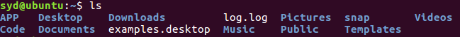
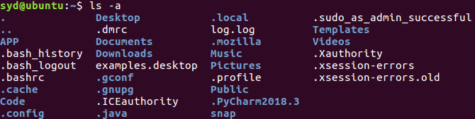
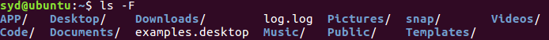
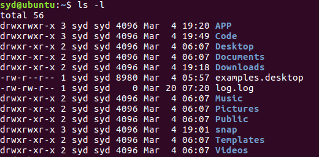
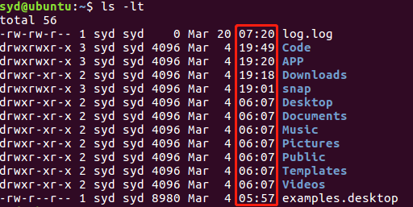
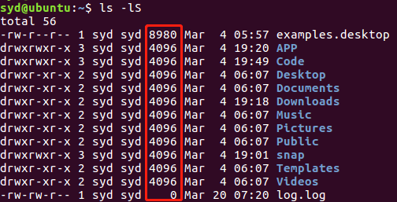
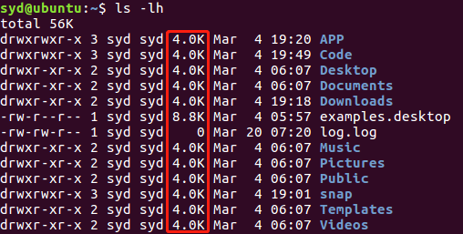
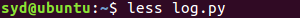
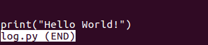

# Linux Command

## `ls`
* `ls` ：显示当前目录下的文件

    

* `ls -a` ：显示所有文件

    

* `ls -F` ：在文件名结尾添加标记已区分文件类型

    

* `ls -l` ：显示当前目录中的文件详情

    

* `ls -t` ：将文件按最后修改时间排序（从近到远）

    

* `ls -S` ：将文件按大小排序（从大到小）

    

* `ls -h` ：将文件的大小转化为可读性强的格式

    

## `less`

* `less "filename"` ：浏览文件内容

    

    

* 浏览过程中的一些快捷键

    * `PgUp` ：向上翻一页

    * `PgDn` ：向下翻一页

    * `Up Arrow` ：向上翻一行

    * `Down Arrow` ：向下翻一行

    * `h` ：显示 less 命令的帮助

    * `q` ：终止浏览，退出文件

    * `/pattern` ：向下查找指定的 pattern

    * `?pattern` ：向上查找指定的 pattern