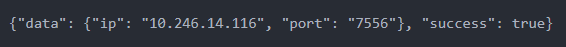
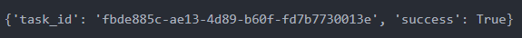
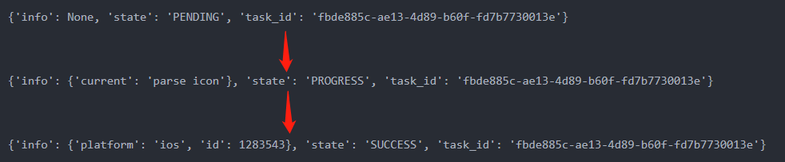
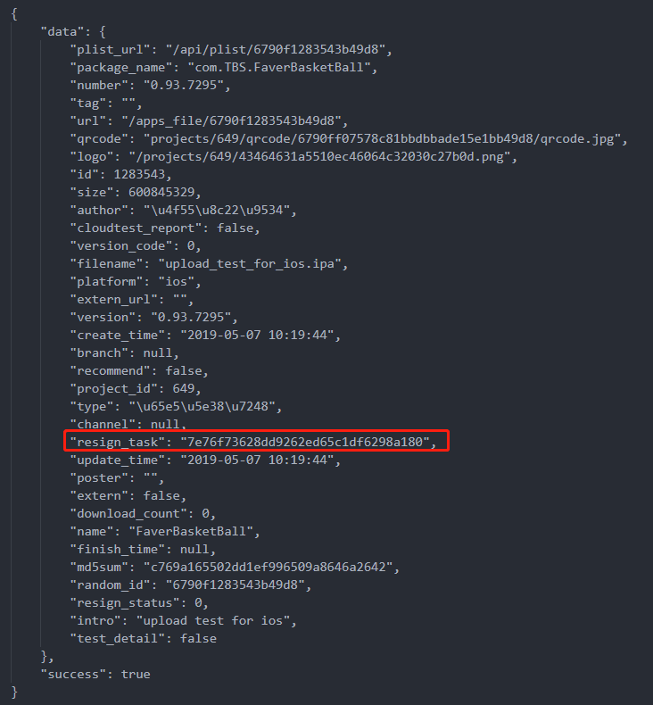
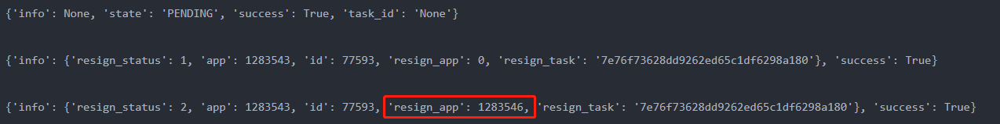
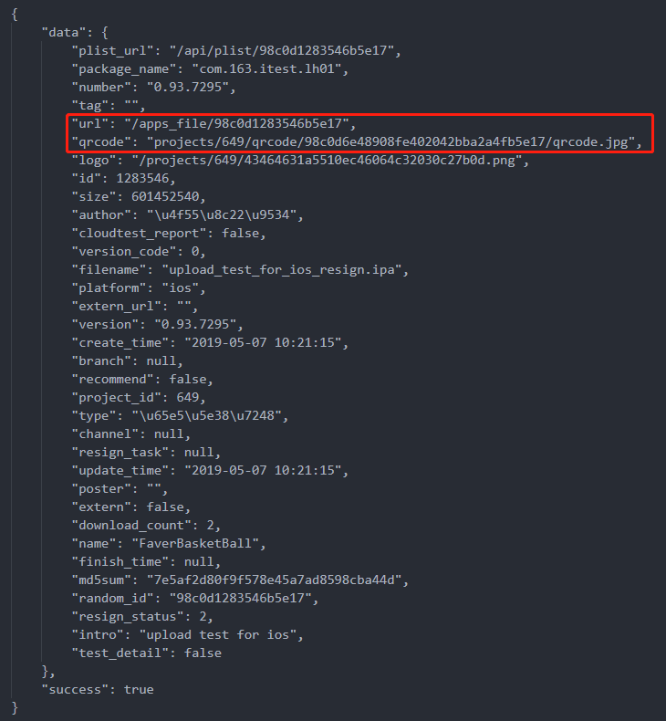

# TestEase iOS上传+重签流程

* 向 `http://test.nie.netease.com/api/host` 发送 `GET` 请求，从 `Response` 中获取 `ip` 和 `port`

    

* 向 `http://*ip*:*port*/api/upload/apps` 发送 `POST` 请求，上传 App，从 `Response` 中获取 `task_id`

    

* 轮询 `http://*ip*:*port*/api/upload/apps/*task_id*`，直到 `status` 字段变为 `SUCCESS`，并获取 `id`

    

* 向 `http://*ip*:*port*/api/apps/*id*` 发送 `GET` 请求，从 `Response` 中获取 `resign_task`

    

* 轮询 `http://*ip*:*port*/api/apps/resign/*resign_task*`，直到 `resign_app` 字段大于 0，并获取 `resign_app`

    

* 向 `http://*ip*:*port*/api/apps/*resign_app*` 发送 `GET` 请求，可以获得重签后的文件的详细信息（包括下载链接）

    


# TestEase iOS上传+重签详细日志

```
E:\Fever_Basketball\QA\BuildTool\Packager>python distributePackage.py
('1: ', u'http://10.246.14.116:7556/api/upload/apps')
uploading...    100%
('2: ', '<Response [200]>')
('3: ', "{u'task_id': u'fbde885c-ae13-4d89-b60f-fd7b7730013e', u'success': True}")
('4: ', "{u'info': None, u'state': u'PENDING', u'task_id': u'fbde885c-ae13-4d89-b60f-fd7b7730013e'}")
app uploading...
('4: ', "{u'info': {u'current': u'parse icon'}, u'state': u'PROGRESS', u'task_id': u'fbde885c-ae13-4d89-b60f-fd7b7730013e'}")
app uploading...
('4: ', "{u'info': {u'platform': u'ios', u'id': 1283543}, u'state': u'SUCCESS', u'task_id': u'fbde885c-ae13-4d89-b60f-fd7b7730013e'}")
upload success
('5: ', "{u'ip': u'10.246.14.116', u'port': u'7556'}")
http://10.246.14.116:7556/api/apps/1283543
{"data": {"plist_url": "/api/plist/6790f1283543b49d8", "package_name": "com.TBS.FaverBasketBall", "number": "0.93.7295", "tag": "", "url": "/apps_file/6790f1283543b49d8", "qrcode": "projects/649/qrcode/6790ff07578c81bbdbbade15e1bb49d8/qrcode.jpg", "logo": "/projects/649/43464631a5510ec46064c32030c27b0d.png", "id": 1283543, "size": 600845329, "author": "\u4f55\u8c22\u9534", "cloudtest_report": false, "version_code": 0, "filename": "upload_test_for_ios.ipa", "platform": "ios", "extern_url": "", "version": "0.93.7295", "create_time": "2019-05-07 10:19:44", "branch": null, "recommend": false, "project_id": 649, "type": "\u65e5\u5e38\u7248", "channel": null, "resign_task": null, "update_time": "2019-05-07 10:19:44", "poster": "", "extern": false, "download_count": 0, "name": "FaverBasketBall", "finish_time": null, "md5sum": "c769a165502dd1ef996509a8646a2642", "random_id": "6790f1283543b49d8", "resign_status": 1, "intro": "upload test for ios", "test_detail": false}, "success": true}

{u'data': {u'plist_url': u'/api/plist/6790f1283543b49d8', u'package_name': u'com.TBS.FaverBasketBall', u'resign_status': 1, u'number': u'0.93.7295', u'tag': u'', u'qrcode': u'projects/649/qrcode/6790ff07578c81bbdbbade15e1bb49d8/qrcode.jpg', u'logo': u'/projects/649/43464631a5510ec46064c32030c27b0d.png', u'id': 1283543, u'size': 600845329, u'author': u'\u4f55\u8c22\u9534', u'cloudtest_report': False, u'version_code': 0, u'filename': u'upload_test_for_ios.ipa', u'platform': u'ios', u'extern_url': u'', u'version': u'0.93.7295', u'branch': None, u'recommend': False, u'project_id': 649, u'type': u'\u65e5\u5e38\u7248', u'channel': None, u'resign_task': None, u'update_time': u'2019-05-07 10:19:44', u'poster': u'', u'extern': False, u'download_count': 0, u'intro': u'upload test for ios', u'name': u'FaverBasketBall', u'url': u'/apps_file/6790f1283543b49d8', u'md5sum': u'c769a165502dd1ef996509a8646a2642', u'random_id': u'6790f1283543b49d8', u'finish_time': None, u'create_time': u'2019-05-07 10:19:44', u'test_detail': False}, u'success': True}
app resigning...
http://10.246.14.116:7556/api/apps/resign/None
{u'info': None, u'state': u'PENDING', u'success': True, u'task_id': u'None'}
http://10.246.14.116:7556/api/apps/resign/None
{u'info': None, u'state': u'PENDING', u'success': True, u'task_id': u'None'}
http://10.246.14.116:7556/api/apps/resign/None
{u'info': None, u'state': u'PENDING', u'success': True, u'task_id': u'None'}
http://10.246.14.116:7556/api/apps/resign/None
{u'info': None, u'state': u'PENDING', u'success': True, u'task_id': u'None'}
http://10.246.14.116:7556/api/apps/resign/7e76f73628dd9262ed65c1df6298a180
{u'info': {u'resign_status': 1, u'app': 1283543, u'id': 77593, u'resign_app': 0, u'resign_task': u'7e76f73628dd9262ed65c1df6298a180'}, u'success': True}
http://10.246.14.116:7556/api/apps/resign/7e76f73628dd9262ed65c1df6298a180
{u'info': {u'resign_status': 1, u'app': 1283543, u'id': 77593, u'resign_app': 0, u'resign_task': u'7e76f73628dd9262ed65c1df6298a180'}, u'success': True}
http://10.246.14.116:7556/api/apps/resign/7e76f73628dd9262ed65c1df6298a180
{u'info': {u'resign_status': 1, u'app': 1283543, u'id': 77593, u'resign_app': 0, u'resign_task': u'7e76f73628dd9262ed65c1df6298a180'}, u'success': True}
http://10.246.14.116:7556/api/apps/resign/7e76f73628dd9262ed65c1df6298a180
{u'info': {u'resign_status': 1, u'app': 1283543, u'id': 77593, u'resign_app': 0, u'resign_task': u'7e76f73628dd9262ed65c1df6298a180'}, u'success': True}
http://10.246.14.116:7556/api/apps/resign/7e76f73628dd9262ed65c1df6298a180
{u'info': {u'resign_status': 1, u'app': 1283543, u'id': 77593, u'resign_app': 0, u'resign_task': u'7e76f73628dd9262ed65c1df6298a180'}, u'success': True}
http://10.246.14.116:7556/api/apps/resign/7e76f73628dd9262ed65c1df6298a180
{u'info': {u'resign_status': 1, u'app': 1283543, u'id': 77593, u'resign_app': 0, u'resign_task': u'7e76f73628dd9262ed65c1df6298a180'}, u'success': True}
http://10.246.14.116:7556/api/apps/resign/7e76f73628dd9262ed65c1df6298a180
{u'info': {u'resign_status': 1, u'app': 1283543, u'id': 77593, u'resign_app': 0, u'resign_task': u'7e76f73628dd9262ed65c1df6298a180'}, u'success': True}
http://10.246.14.116:7556/api/apps/resign/7e76f73628dd9262ed65c1df6298a180
{u'info': {u'resign_status': 1, u'app': 1283543, u'id': 77593, u'resign_app': 0, u'resign_task': u'7e76f73628dd9262ed65c1df6298a180'}, u'success': True}
http://10.246.14.116:7556/api/apps/resign/7e76f73628dd9262ed65c1df6298a180
{u'info': {u'resign_status': 1, u'app': 1283543, u'id': 77593, u'resign_app': 0, u'resign_task': u'7e76f73628dd9262ed65c1df6298a180'}, u'success': True}
http://10.246.14.116:7556/api/apps/resign/7e76f73628dd9262ed65c1df6298a180
{u'info': {u'resign_status': 1, u'app': 1283543, u'id': 77593, u'resign_app': 0, u'resign_task': u'7e76f73628dd9262ed65c1df6298a180'}, u'success': True}
http://10.246.14.116:7556/api/apps/resign/7e76f73628dd9262ed65c1df6298a180
{u'info': {u'resign_status': 1, u'app': 1283543, u'id': 77593, u'resign_app': 0, u'resign_task': u'7e76f73628dd9262ed65c1df6298a180'}, u'success': True}
http://10.246.14.116:7556/api/apps/resign/7e76f73628dd9262ed65c1df6298a180
{u'info': {u'resign_status': 1, u'app': 1283543, u'id': 77593, u'resign_app': 0, u'resign_task': u'7e76f73628dd9262ed65c1df6298a180'}, u'success': True}
http://10.246.14.116:7556/api/apps/resign/7e76f73628dd9262ed65c1df6298a180
{u'info': {u'resign_status': 1, u'app': 1283543, u'id': 77593, u'resign_app': 0, u'resign_task': u'7e76f73628dd9262ed65c1df6298a180'}, u'success': True}
http://10.246.14.116:7556/api/apps/resign/7e76f73628dd9262ed65c1df6298a180
{u'info': {u'resign_status': 1, u'app': 1283543, u'id': 77593, u'resign_app': 0, u'resign_task': u'7e76f73628dd9262ed65c1df6298a180'}, u'success': True}
http://10.246.14.116:7556/api/apps/resign/7e76f73628dd9262ed65c1df6298a180
{u'info': {u'resign_status': 2, u'app': 1283543, u'id': 77593, u'resign_app': 1283546, u'resign_task': u'7e76f73628dd9262ed65c1df6298a180'}, u'success': True}
{u'data': {u'plist_url': u'/api/plist/98c0d1283546b5e17', u'package_name': u'', u'resign_status': 2, u'number': u'unknown', u'tag': u'', u'qrcode': u'projects/649/qrcode/98c0d6e48908fe402042bba2a4fb5e17/qrcode.jpg', u'logo': u'/projects/649/43464631a5510ec46064c32030c27b0d.png', u'id': 1283546, u'size': 600845329, u'author': u'\u4f55\u8c22\u9534', u'cloudtest_report': False, u'version_code': 0, u'filename': u'upload_test_for_ios_resign.ipa', u'platform': u'ios', u'extern_url': u'', u'version': u'unknown', u'branch': None, u'recommend': False, u'project_id': 649, u'type': u'\u65e5\u5e38\u7248', u'channel': None, u'resign_task': None, u'update_time': u'2019-05-07 10:21:15', u'poster': u'', u'extern': False, u'download_count': 0, u'intro': u'upload test for ios', u'name': u'', u'url': u'/apps_file/98c0d1283546b5e17', u'md5sum': u'', u'random_id': u'98c0d1283546b5e17', u'finish_time': None, u'create_time': u'2019-05-07 10:21:15', u'test_detail': False}, u'success': True}
http://10.246.14.116:7556/apps_file/98c0d1283546b5e17
http://10.246.14.116:7556/projects/649/qrcode/98c0d6e48908fe402042bba2a4fb5e17/qrcode.jpg
```