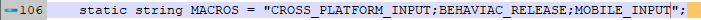
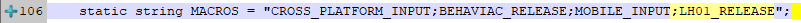
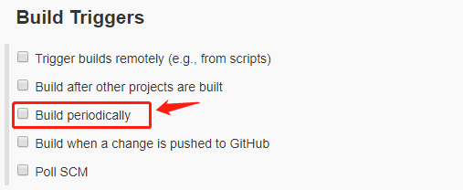
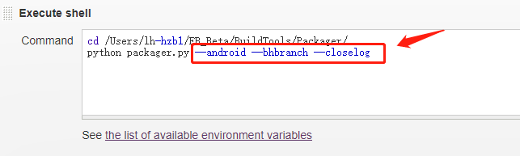
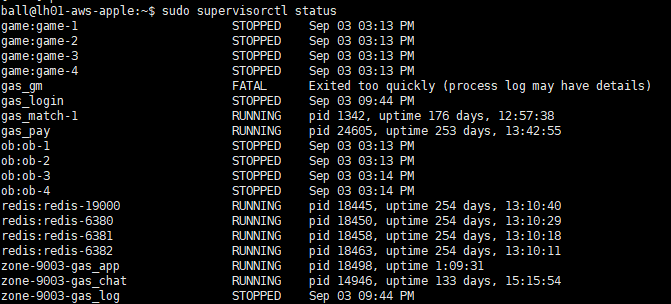
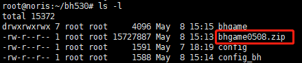
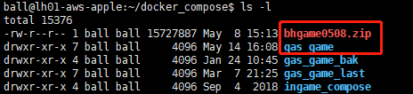
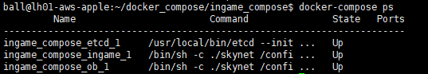

## 
* 更新 `Assets\LuaFramework\Editor\Packager.cs` 中的宏（将区组切换成正式）

    

    

* 更新 Jenkins 中的提审打包配置

    * 取消周期打包选项

        

    * 更改打包参数，取消 `--sendmail`, `--skipecp`, 新增 `--closelog`

        

* 更新打包机工程文件

    * 将 `AssetBundles/iOS` 文件夹中的内容删除

    * 将 `LuaJIT` 文件夹，`luamd5.txt` 文件删除

* 打提审包

    * 打开Xcode工程

    * Bundle ID 改为 `com.netease.lh01`

    * 版本号（顺延）

    * 取消 `Auto Signing`

    * 配置 `Signing (Release)` 和 `Signing (Debug)`

    * 打开 `In-APP Purchase` 和 `Notifications` 选项

    * 添加 `1024*1024` 的 APP icon

    * 执行 `Product -> Archive`

    * 

* 提审服准备

    * 更新 func

        * 文件位置：`~/zone-9003/zone/gas_app/`

        * 用本地最新的代码，分别替换：`match/`, `routes/`, `gas_func.js`, `gas_match.js`

        * 执行 `sudo supervisorctl status` 查看服务器进程

            

        * 执行 `sudo supervisorctl restart zone-9003-gas_app` 重启 func

    * 更新 ingame

        * 文件位置：`~/docker-compose/gas_game/`

        * 将 `gas_game/` 重命名为 `gas_game_last/`

        * 将 `106.14.29.185 (阿里云)` 服务器上的分支ingame打包，解压到提审服务器的 `docker-compose`，并重命名为 `gas_game/`

            

            
        
        * 在 `~/docker-compose/ingame_compose/` 中运行 `docker-compose ps` 查看 ingame 进程

            

        * 在 `~/docker-compose/ingame_compose/` 中运行 `docker-compose down` 和 `docker-compose up` 重启 ingame

    * 更新 GM

        * 文件位置：`~/gas_gm/`

        * 用本地最新的代码，分别替换：`public/`, `routes/`, `views/`, `gas_tool.js`

        * 执行 `sudo supervisorctl status` 查看服务器进程

            

        * 执行 `sudo supervisorctl restart gas_gm` 重启 GM

    * 后台配置

        * 将 `潮人篮球服` 从隐藏设为可见